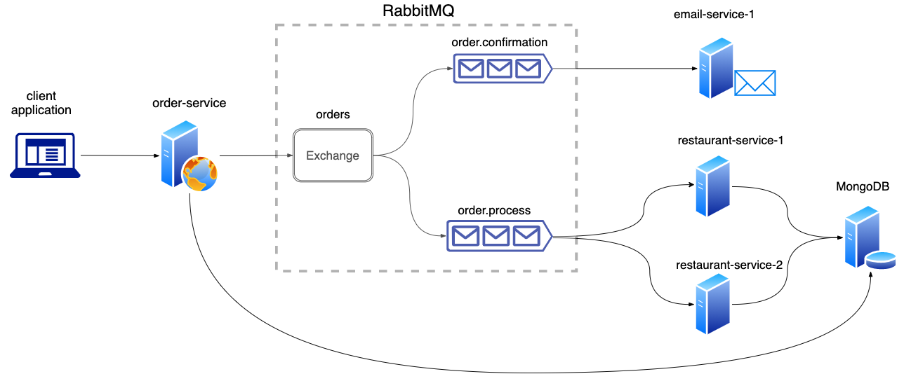

# Burgernaut
A distributed message-based food ordering system developed with RabbitMQ, Node.js, Express and MongoDB.

# System Architecture and Flow
Burgernaut is a distributed food ordering platform that allows clients to place orders and track them. It consists of three integral components - `order-service`, `restaurant-service` and `email-service`. The `order-service` exposes REST endpoints that allow clients to fetch the food menu, place an order and track the order in real-time. Once the client places an order, the `order-service` persists the order details on a MongoDB server and publishes it to a RabbitMQ Exchange. The Exchange is configured with a fanout pattern which publishes the order to the two queues that have been bound to it - `order.process` and `order.confirmation`. While placing it on the queue, the 'status' field of the order holds the value 'pending'. A `restaurant-service` consumes the order from the `order.process` queue and an `email-service` consumes the order from the `order.confirmation` queue. Once the `restaurant-service` consumes the order, it modifies the 'state' of the order to 'accepted' in the database. The `email-service` on the other hand sends an order confirmation to the email address specified in the order. After a pre-defined time period, the `restaurant-service` modifies the 'state' to 'delivered' in the database. The `order-service` can also be used to track an order with the order ID that is returned while placing an order. 

Burgernaut uses a message-based architecture to enhance scalability, flexibility and loose coupling among the various services it comprises. RabbitMQ, by default, ensures that all the messages consumed from a queue are distributed in a round-robin manner. Since the `restaurant-service` and `email-service` consume from these queues, they can be individually and independently scaled - though physically, scaling out the restaurant-service would mean opening new restaurants. The services are configured to process only a limited number of orders at a time to mimic actual business since restaurants have limited staff. The remaining orders wait on the queue to be consumed. The `restaurant-service` is required to send an 'acknowledge' to RabbitMQ to confirm that the order has been fully processed - delivered, in our case. If one of the restaurants stop functioning say, due to a power loss, RabbitMQ is aware that the tcp connection between the restaurant-service and the Exchange has been closed and any order that was being processed is automatically added back to the queue, ready to be consumed by another restaurant-service. This enhances the fault-tolerance of the system. The number of orders that can be handled by the `restaurant-service` and the amount of time it takes to process an order can be configured with their respective environment variables.

As is evident, the system required asynchronous communication for its components which are difficult to achieve with REST or RPC based systems as they are inherently blocking in nature. The system also required a highly-available and fault-tolerant queueing service for queueing the orders to prevent overwhelming the downstream components during peak time. RabbitMQ aids in satisfying these requirements. This also enhances the user experience. Instead of rejecting an order at peak load intervals, the order gets queued and a response is sent immediately to the client. As soon as a restaurant is available, it will consume it. Simply put, it tells the client - "Hey, I got your order and we are working on it. Here's an order confirmation ID to track it." 

## Getting Started (with Docker)
If you have Docker installed in your computer, you do not need to have Node.js, RabbitMQ or MongoDB installed. You can run the application with a single command:
  ```bash
  $ docker-compose up
  ```
Note: email-service requires a valid email ID and password to send order confirmations. Update them in the <i>environment</i> section of <i>email-service</i> in <i>docker-compose.yml</i>. The application can be tweaked with the environment variables defined in this file.

To scale each component independently, use:
  ```bash
  $ docker-compose up --scale <service-name>=<number-of-containers>
  ```

For example, use the below command to replicate the architecture displayed in the system architecture diagram:
  ```bash
  $ docker-compose up --scale restaurant-service=2
  ```
## Getting Started (without Docker)
Without Docker, you need to install RabbitMQ, Node.js, NPM, MongoDB. </br>
To install Node.js and NPM, refer to the documentation provided [here](https://nodejs.org/en/download/package-manager).</br>
To install MongoDB, refer to the documentation provided [here](https://docs.mongodb.com/manual/installation/).
To install RabbitMQ, refer to the documentation provided [here](https://www.rabbitmq.com/download.html).
### Step 1 - Start RabbitMQ and MongoDB
To start RabbitMQ and MongoDB:
- Mac:
    ```bash
    $ mongod --config /usr/local/etc/mongod.conf
    ```
    ```bash
    $ rabbitmq-server
    ```

NOTE: Database and collection is automatically created with the first `POST` request to `/api/books`. No MongoDB configuration is required after installation - keeping MongoDB running is sufficient.
### Step 2 - Start all three node applications
To get the Node server running locally:
- `npm install` to install all required dependencies from package.json:
    ```bash
    $ npm install
    ```
- `npm start` to start the local server:
    ```bash
    $ npm run start
    ```
- `npm run dev` to start the local server in development mode:
    ```bash
    $ npm run dev
    ```
Run the `install` and `start` commands for email-service, order-service and restaurant-service.

## API
## Get menu
----
  Returns json data containing menu.

* **URL**

  /api/menu

* **Method:**

  `GET`
  
*  **URL Params**
   None
   
    
*  **Query Params**
   
   None
    
 * **Data Params**
   
  None

* **Success Response:**

  * **Code:** 200<br/>
    **Content:** `{
    "items": [
        {
            "name": "burger",
            "price": 50
        },
        {
            "name": "fries",
            "price": 20
        },
        {
            "name": "coke",
            "price": 10
        }
    ]
}`
## Place a new order
----
  Returns json containing details of the placed order.

* **URL**

  /api/orders

* **Method:**

  `POST`
  
*  **URL Params**

    None

* **Query Params**

  None
  
 * **Data Params**
   
    **Required:**
    * `items: [array]`
      * `name: [string]`
      * `quantity: [number]`
    * `email: [string]`

* **Success Response:**

  * **Code:** 201 CREATED<br/>
    **Content:** `{
    "total": 900,
    "status": "pending",
    "_id": "600307ce7a72ea0013a034f6",
    "items": [
        {
            "name": "burger",
            "quantity": 10,
            "_id": "600307ce7a72ea0013a034f7"
        },
        {
            "name": "fries",
            "quantity": 20,
            "_id": "600307ce7a72ea0013a034f8"
        }
    ],
    "email": "test@gmail.com",
    "createdAt": "2021-01-16T15:35:42.975Z",
    "__v": 0
}`


## Get order details
----
  Returns json data containing order details and the updated order status.

* **URL**

  /api/orders/:id

* **Method:**

  `GET`
  
*  **URL Params**
   `id: [string]`
   
*  **Query Params**
   
   None
    
 * **Data Params**
   
    None

* **Success Response:**

  * **Code:** 200<br/>
    **Content:** `{
    "total": 900,
    "status": "delivered",
    "_id": "600307ce7a72ea0013a034f6",
    "items": [
        {
            "name": "burger",
            "quantity": 10
        },
        {
            "name": "fries",
            "quantity": 20
        }
    ],
    "email": "test@gmail.com",
    "createdAt": "2021-01-16T15:35:42.975Z"
}`
 
## Authors
* **Dhanush Kamath** - [dhanushkamath](https://github.com/dhanushkamath)